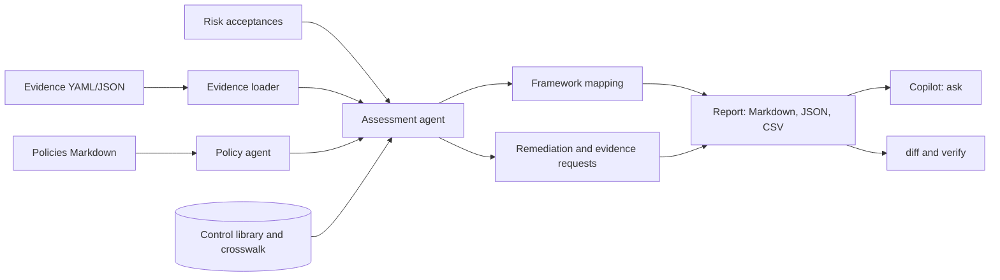

# Compliance Copilot

Point it at your evidence and policies and it tells you where you stand against SOC 2, ISO 27001, NIST CSF,
HIPAA, PCI DSS and GDPR at the same time. It tests each control against dated evidence, lists what is failing
and what is missing, orders the fixes by how much they matter across frameworks, and answers questions about
the result with citations.

One control library covers all six frameworks. Multi-factor authentication is one control that supports
SOC 2 CC6.1, ISO 27001 A.8.5, NIST PR.AA-03, HIPAA 164.312(d), PCI DSS 8.4 and GDPR Art. 32, so you collect
the evidence once and see the effect everywhere.

It is a readiness tool, not an auditor. A passing result means the evidence you supplied satisfies the checks
in this library, not that an audit will pass.

## What it does

| Stage | Agent | Output |
| ----- | ----- | ------ |
| 1 | Evidence loader | Reads YAML or JSON evidence, validates it, and records a SHA-256 hash and age for each record |
| 2 | Policy agent | Reviews Markdown policies for required sections, an owner, an approver and a review date |
| 3 | Assessment agent | Tests 35 controls (66 checks) against fresh evidence, notices conflicts, and applies approved risk acceptances |
| 4 | Framework mapping | Readiness per framework and per requirement reference, from the crosswalk |
| 5 | Planning agents | Remediation plan ordered by priority, and a list of the evidence still needed |
| 6 | Copilot agent | Answers questions about controls, requirements, readiness, priorities and evidence, citing control and evidence ids |
| 7 | Comparison and verification | `diff` finds regressions between two assessments, and `verify` detects evidence changed since an assessment |



## Quick start

```bash
python -m venv .venv && source .venv/bin/activate     # Windows: .venv\Scripts\activate
python -m pip install -e ".[dev]"

compcopilot frameworks
compcopilot assess --evidence configs/evidence --policies configs/policies \
    --exceptions configs/exceptions.yaml --as-of 2026-09-19 --out out
compcopilot ask --assessment out/assessment.json "Are we covered for CC6.1?"
```

The bundled data describes a fictional company. It has 19 evidence records, three policies and two risk
acceptances, chosen to exercise every outcome.

### Example output

```text
soc2       SOC 2 Trust Services Criteria         31 controls   26 requirements
iso27001   ISO/IEC 27001:2022 Annex A            31 controls   36 requirements
nist_csf   NIST Cybersecurity Framework 2.0      31 controls   28 requirements
hipaa      HIPAA Security Rule                   28 controls   27 requirements
pci_dss    PCI DSS 4.0                           30 controls   30 requirements
gdpr       GDPR                                  26 controls   11 requirements
```

```text
| Framework                        | Ready | Controls | Satisfied | Partial | Risk accepted | Gaps | Not assessed |
| SOC 2 Trust Services Criteria    | 69.4% | 31       | 15        | 12      | 1             | 2    | 1            |
| ISO/IEC 27001:2022 Annex A       | 67.7% | 31       | 14        | 13      | 1             | 2    | 1            |
| NIST Cybersecurity Framework 2.0 | 69.4% | 31       | 15        | 12      | 1             | 2    | 1            |
| HIPAA Security Rule              | 67.9% | 28       | 14        | 9       | 1             | 2    | 2            |
| PCI DSS 4.0                      | 70.0% | 30       | 15        | 11      | 1             | 2    | 1            |
| GDPR                             | 67.3% | 26       | 12        | 10      | 1             | 2    | 1            |
```

Asking about a requirement, a control, or what is missing:

```text
$ compcopilot ask ... "Are we covered for CC6.1?"
CC6.1 is supported by AC-01, AC-04, DP-01, DP-03; the weakest is partial.
  AC-01 Multi-factor authentication: partial.
  AC-04 Strong authentication settings: satisfied.
  DP-01 Encryption at rest: satisfied.
  DP-03 Cryptographic key management: satisfied.
Controls: AC-01, AC-04, DP-01, DP-03
Evidence: EV-CLOUD-001, EV-IAM-001

$ compcopilot ask ... "AC-03"
AC-03 Timely removal of access (high) is gap.
  Failing: iam.offboarding_sla_hours <= 24 (actual 48).
  Failing: iam.orphaned_accounts == 0 (actual 3).
  Next: Connect HR leaver events to account disablement. Remove or disable orphaned and shared accounts.

$ compcopilot ask ... "What evidence is missing?"
6 facts still need evidence:
  BC-01: bcdr.plan_current (only stale evidence: EV-BCDR-001 is 395 days old, limit 365). ...
  HP-01: hipaa.baa_coverage_pct (no evidence). ...
  PC-01: pci.cde_scope_documented (no evidence). ...
```

The disaster recovery sign-off is 395 days old, so it no longer counts and BC-01 goes back to "not assessed".
The old vulnerability scan is ignored because a newer one exists. The HIPAA and PCI controls have no evidence
at all, and they are listed as requests instead of being guessed.

## How evidence works

An evidence record is a dated set of facts:

```yaml
evidence:
  - id: EV-IAM-001
    type: config              # config, policy, scan, attestation, log_sample, training, report
    title: Identity provider export
    source: Okta admin report
    collected_at: 2026-09-01T09:00:00Z
    owner: it-ops
    facts:
      iam:
        mfa_admins_pct: 100
        mfa_all_users_pct: 88
```

Nested facts flatten to dotted names (`iam.mfa_all_users_pct`). Each control lists checks such as
`iam.mfa_all_users_pct >= 90`. Run `compcopilot controls --ref CC6.1` to see the controls behind a
requirement, and read `src/compcopilot/catalog.py` for every check.

- A control is satisfied when all checks pass, partial when some do, a gap when none do, and not assessed
  when no fresh evidence exists.
- Each control has a freshness limit. Evidence older than that is ignored and named in the report.
- If several recent evidence items disagree about a fact, the control is at best partial and the conflict is
  reported. Evidence more than 30 days older than the newest is treated as superseded.
- Policies are read from Markdown. A policy counts as current when it has an owner, an approver, a review
  date within a year, and the sections purpose, scope, roles, requirements, exceptions and review.
- Facts that no control uses are reported as warnings, which catches typos in evidence files.

### Risk acceptances

```yaml
exceptions:
  - control: AC-05
    reason: Just-in-time admin access is planned for Q1. Sessions are reviewed manually until then.
    approved_by: CISO
    approved_on: 2026-08-15
    expires: 2026-12-31
```

Until it expires, an accepted gap shows as "risk accepted" and counts half toward readiness. After it expires
it is reported and the control returns to its real status.

## Commands

| Command | Purpose |
| ------- | ------- |
| `frameworks` | Frameworks with control and requirement counts |
| `controls [--framework F] [--ref REF]` | List controls, or the controls that support one requirement |
| `assess --evidence DIR [--policies DIR] [--exceptions FILE] [--framework F ...] [--as-of DATE] [--out DIR] [--format md,json,csv]` | Assess controls. Without `--out` the Markdown goes to the terminal |
| `assess ... --requirements FRAMEWORK` | Requirement-level coverage for audit preparation |
| `assess ... --fail-under PCT` or `--fail-on-gap SEVERITY` | Exit 1 when readiness is below a threshold, or a control of that severity or worse has a gap |
| `ask QUESTION [--assessment FILE]` | Answer a question, from a saved assessment or by assessing on the fly |
| `diff BEFORE.json AFTER.json [--fail-on-regression]` | Controls that got worse or better, and the readiness change |
| `verify --assessment FILE --evidence DIR` | Check that evidence on disk still matches what was assessed |

Exit codes: 0 success, 1 a gate failed, 2 invalid input.

### Use it in CI

```bash
compcopilot assess --evidence evidence --policies policies --out out --fail-on-gap critical
compcopilot diff last-month/assessment.json out/assessment.json --fail-on-regression
```

The JSON assessment is a stable artifact. Commit it, compare it next month, and hand `assessment.csv` to your
auditor as a control index.

## Priority

`priority = severity weight x (1 + 0.25 per extra framework in scope) x status factor`, where severity weights
are low 2, medium 4, high 7 and critical 10, and the status factor is 1.0 for a gap, 0.7 for partial and 0.6
for not assessed. A critical control that supports six frameworks and is only partly done scores 15.75. A
medium control that supports one framework and has a gap scores 4.

## Configuration

Environment variables use the `COMPCOPILOT_` prefix, and `.env.example` documents each one. An optional
language model can write the executive summary. It receives only counts and readiness percentages, never
control, evidence or policy text, and its output is discarded unless every number in it is in those facts.

## Limitations

Read these before you rely on the output.

- The framework identifiers and control mappings are a good-faith crosswalk written for this project. They
  are not official mappings and the control titles are short paraphrases, not framework text. Verify the
  references you depend on against the current published framework, because frameworks are revised.
- Thirty-five controls do not cover every requirement of six frameworks. Physical, HR and organisational
  requirements in particular are thin. The requirement view shows which references are covered.
- A check passes when the evidence says so. The tool cannot tell whether an attestation is honest or an export
  is complete. Use `verify` to prove it has not changed since assessment, not that it is right.
- Evidence is supplied as files. There are no live collectors for cloud, identity or ticketing systems.
- The copilot answers from the assessment with rules. It does not reason about your business and it says so
  when it does not recognise a question.
- Readiness percentages are a planning measure. They are not a certification or an audit opinion.

## Development

```bash
make lint        # ruff check and format check
make typecheck   # mypy --strict
make cov         # tests with an 80% coverage gate (currently about 98%)
make audit       # pip-audit on runtime dependencies
```

The 200-plus tests run offline. They cover the check parser, every comparison operator, staleness and
conflict handling, risk acceptances, readiness arithmetic, the priority formula, each copilot intent,
tamper detection, spreadsheet-formula and markup injection in reports, and full CLI runs. See
[CONTRIBUTING.md](CONTRIBUTING.md) and [docs/architecture.md](docs/architecture.md).

## Docker

```bash
docker build -t compliance-copilot .
docker run --rm -v "$PWD:/work" compliance-copilot assess --evidence configs/evidence --as-of 2026-09-19
```

## License

MIT. See [LICENSE](LICENSE).
