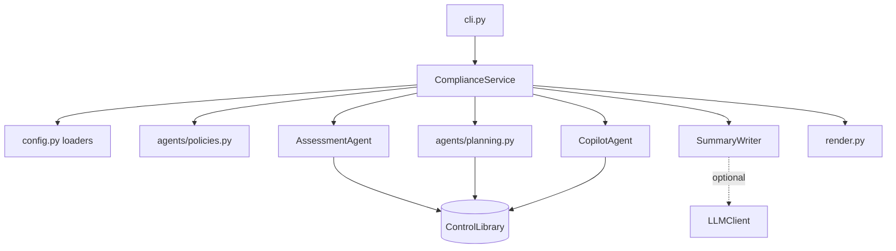

# Architecture

## Overview

`compcopilot` is a stateless pipeline over files. It loads evidence, policies and risk acceptances, tests a
library of common controls against them, and renders the result. The composition root
(`container.build_service`) wires the control library and the summary writer, and `ComplianceService` is the
facade the CLI and library callers use.

## Modules

| Module | Responsibility |
| ------ | -------------- |
| `models.py` | Controls, checks, evidence, results, readiness and assessment models |
| `catalog.py` | The check mini-language and the control library with its crosswalk to framework references |
| `config.py` | Settings, evidence and exception loaders, fact flattening and evidence hashing |
| `agents/policies.py` | Section, owner, approver and review-date analysis of Markdown policies |
| `agents/assessment.py` | Check evaluation, freshness, conflicts, status, risk acceptance, readiness and requirement coverage |
| `agents/planning.py` | Remediation priority, evidence requests and comparison of two assessments |
| `agents/copilot.py` | Rule-based question answering with citations |
| `agents/summary.py` | Template and optional model-backed summary with a grounding check |
| `service.py` | Orchestration, evidence verification and warnings |
| `render.py` | Markdown, JSON, CSV and diff output with escaping |

## Assessment

1. Every evidence record is flattened to dotted facts. Policies contribute facts named
   `policy.<slug>.current`, `.approved`, `.age_days` and `.sections_missing`.
2. Facts are indexed by name with the evidence id, age and value.
3. Each control in scope runs its checks. For a check the agent takes the evidence newer than the control's
   freshness limit, keeps items within 30 days of the newest, evaluates each and reports a conflict if they
   disagree. No evidence, or only stale evidence, leaves the check untested (`passed = None`).
4. The control status follows from its checks. All untested is not assessed. All passing without a conflict is
   satisfied. Some failing and none passing is a gap. Anything else is partial.
5. An unexpired risk acceptance turns a non-satisfied control into accepted. An expired one is reported.
6. Readiness per framework is the average of control points (satisfied 1, partial and accepted 0.5). Each
   framework requirement is as weak as the weakest control that supports it.

## Why a common control library

Frameworks overlap heavily. Assessing each one separately means asking for the same evidence several times and
losing sight of which fix helps the most. The library defines each practice once, with testable checks and a
list of the requirements it supports. Priority multiplies severity by the number of frameworks in scope, so
work that closes gaps across several frameworks rises to the top.

## Determinism

Assessments depend only on the inputs and the `as_of` date, which defaults to today and can be fixed for
reproducible runs. Evidence hashes use canonical JSON, so reformatting a file does not change its hash.

## Extending

- New control: add a `_c(...)` entry in `catalog.py` with checks, framework references, remediation steps and
  the evidence types that can satisfy it. Tests require unique ids, unique fact names and at least one
  reference.
- New framework: add it to `FrameworkId` and `FRAMEWORK_NAMES`, then add references to the controls that support it.
- New operator: extend `CheckOp`, the parser and `evaluate`, with tests for both outcomes.
- New question type: add an intent to `CopilotAgent.ask`. It must build its answer from the assessment and cite
  the controls it used.
